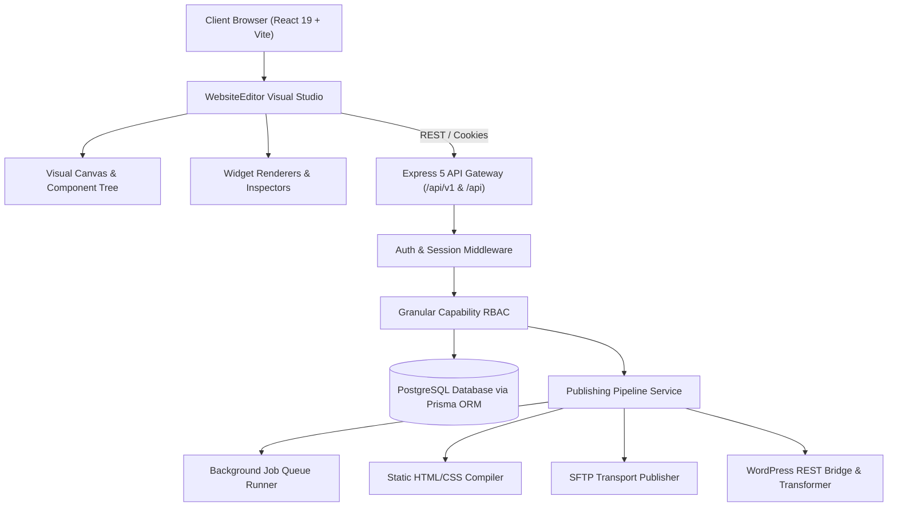

# Deliverable 01: Current Architecture Report
**Project:** ForgeStudio SaaS Platform  
**Date:** September 2026  
**Audience:** CTO, Principal Architects, Lead Engineers  

---

## 1. Executive Summary & Topology

ForgeStudio is structured as a TypeScript full-stack mono-repository designed as an Elementor-grade visual website builder delivered via a multi-tenant Software-as-a-Service (SaaS) model.

The platform architecture is cleanly separated into three primary sub-systems:
1. **Frontend (`/frontend`):** A client-side visual design studio built with React 19, TypeScript, Tailwind CSS v4, Monaco Editor, Lucide React, and Vite. It features a canvas visual editor, multi-device viewport controls, an element hierarchy navigator, responsive style inspectors, and modal toolings for custom code, fonts, popups, and site settings.
2. **Backend (`/backend`):** A RESTful and Event-driven Node.js application built with Express 5, TypeScript, Prisma ORM 7.10, and PostgreSQL. It manages tenant isolation, authentication, session tokens, role-based authorization, database persistence, revisions, publishing pipelines, job queuing, and external destinations (WordPress, SFTP, Static ZIP).
3. **Connector/Runtime Layer:** Multi-destination publishing adapters capable of compiling the canonical JSON document into static HTML5 bundles, deploying over SFTP with directory reconciliation, or transforming into WordPress Gutenberg block markup.



---

## 2. Source-of-Truth Conceptual Flow

In ForgeStudio, the single canonical source of truth for any website is **not** raw HTML, **not** WordPress post records, and **not** ad-hoc CSS stylesheets. Instead, every website is authored, manipulated, and persisted as structured **`CanonicalWebsiteData`**:

```
[User Canvas Interaction]
           │
           ▼
[Editor State Mutators & History Stack]
           │
           ▼
[CanonicalWebsiteData (JSON Document)]
   ├─ id, version, homePageId
   ├─ pages: PageConfig[] (elements tree, settings, slugs)
   ├─ siteSettings: { siteName, logo, favicon, maintenance }
   ├─ globalStyles: { colors, typography, layout, breakpoints }
   ├─ siteParts: { header, footer, 404, single, archive }
   ├─ navigation: NavMenuItem[]
   └─ publishing & deployment state
           │
           ▼
[Durable Server-Side Persistence (PostgreSQL 'websites' & 'website_revisions')]
           │
           ▼
[Destination Transformation & Compilation]
   ├─ Static Web Export (Compiled HTML5, Normalized CSS, Runtime JS)
   ├─ SFTP Deployment (Directory syncing, byte verification)
   └─ WordPress Connector (Gutenberg blocks, Yoast/RankMath meta, page mappings)
```

---

## 3. Backend Architecture & Domain Boundaries

### 3.1 Application Bootstrap & HTTP Middleware
- **Entry Points:** `src/server.ts` bootstraps the server; `src/app.ts` configures middleware and route trees.
- **Security Middleware:** 
  - `helmet`: Cross-Origin Resource Policy configured for cross-origin asset loading.
  - `cors`: Restricted to `FRONTEND_URL` with credential support.
  - `cookieParser`: Reads signed/secure session tokens.
  - `express.json` / `urlencoded`: Body size restricted to 2MB to prevent denial-of-service memory exhaustion.
  - `passport.js`: Configured for OAuth 2.0 (Google, GitHub) alongside email/phone verification.

### 3.2 Domain Boundaries
1. **Identity & Access Management (IAM):**
   - User entity (`User`), credentials (`passwordHash`), identities (`Identity` for OAuth), multi-channel OTP (`OtpVerification` for email/WhatsApp), session revocation (`Session`), and password recovery (`PasswordResetToken`).
2. **Organization, Workspace & Multi-Tenancy:**
   - Hierarchy: `Organization` -> `Workspace` -> `Website` (Project).
   - Roles: `OrganizationMember` (OWNER, ADMIN, MEMBER), `WorkspaceMember` (OWNER, ADMIN, MEMBER).
3. **Permissions & Access Control (RBAC):**
   - Express middleware `authorizeCapability(capability, resourceId)`.
   - Evaluation: Owner check -> Specific Resource Override -> Global Wildcard Override -> Role Defaults (`OWNER`, `ADMIN`, `DESIGNER`, `CONTENT_EDITOR`, `REVIEWER`).
4. **Content & Visual Engine:**
   - `Website`: Stores name, slug, status, and JSONB `editorData`.
   - `WebsiteRevision`: Immutable point-in-time snapshots of `editorData` with versioning, description, and author attribution.
5. **Publishing & Deployment Engine:**
   - `Deployment`: Tracks deployment status (`QUEUED`, `VALIDATING`, `BUILDING`, `PROCESSING`, `DEPLOYING`, `VERIFYING`, `PUBLISHED`, `RECONCILIATION_REQUIRED`, `FAILED`).
   - Destination Abstraction (`DestinationPublisher`): Internal, WordPress, SFTP, and Static Export.
6. **Background Job Runner & Queue:**
   - Durable PostgreSQL-backed job queue (`BackgroundJob`) with in-memory fallback.
   - Handlers: Scheduled publish (`SCHEDULED_PUBLISH`), deployment verification (`DEPLOYMENT_VERIFY`), webhook retries (`WEBHOOK_RETRY`), and asset optimization (`MEDIA_OPTIMIZATION`).

---

## 4. Frontend Architecture & Component Boundaries

### 4.1 Routing & Layout Layer
- **Router (`App.tsx`):** Configured with `react-router-dom` v7.
- **Route Protection:** `RoleRoute` validates user session and role (`USER`, `ADMIN`, `SUPER_ADMIN`).
- **Active Routes:**
  - `/login`, `/signup`: Authentication entry points.
  - `/dashboard`: Main user project portal with tabs for websites, developer API, plugin hub, custom code, CPTs, and composer.
  - `/editor/:websiteId`: The primary visual editor studio.
  - `/site/:websiteId`, `/site/:websiteId/:pageSlug`: Public runtime renderer (`PublishedSite.tsx`).
  - `/admin`, `/super-admin`: Admin dashboards (currently placeholder scaffolds).

### 4.2 Visual Editor (`WebsiteEditor.tsx`)
- Single unified studio orchestrating:
  - **Top Bar:** Responsive viewport toggles (Desktop, Tablet, Mobile), zoom controls, undo/redo buttons, autosave indicators, code preview modal triggers, and publish buttons.
  - **Left Sidebar:** Tabbed switcher between Widget Inserter (Components, Layout, Pro Widgets), Element Tree / Navigator (Layers), Global Site Settings, and Design System Variables.
  - **Center Canvas:** Live visual workspace executing HTML5 drag-and-drop, inline editing, hover highlighting, selection indicators, and inline styling previews.
  - **Right Panel (Inspector):** Context-aware inspectors for Content, Style (typography, background, borders, spacing, shadows, dimensions), Advanced (custom CSS, attributes, display conditions), and Motion Effects.

### 4.3 Feature Subsystems (`frontend/src/features/`)
- `atomic-editor`: Variables manager, reusable classes, atomic loops, grids, forms.
- `autosave`: Debounced background state syncing with dirty flags.
- `fonts`: Dynamic Google Fonts loader, system font fallbacks, custom web font registry.
- `global-widget`: Synchronized reusable widgets.
- `publishing`: Validation, multi-target publish dialogs, deployment history, rollback.
- `revision-history`: Version comparison and restoration.
- `templates` & `website-kits`: Pre-built multi-page website packages and section templates.

---

## 5. Architectural Strengths & High-Value Assets
1. **Deterministic Canonical Schema:** The `CanonicalWebsiteData` abstraction cleanly insulates the editor from backend storage formats and external publishing targets.
2. **Pluggable Destination Architecture:** `DestinationPublisher` contract allows adding new publishing targets without altering core editor code.
3. **Durable Revisions & Deployments:** Revisions and deployments are stored with relational integrity in PostgreSQL with immutable JSON snapshots.
4. **Rich Widget & Inspector Breadth:** Over 60 widget types and comprehensive property controls already exist in the codebase.
