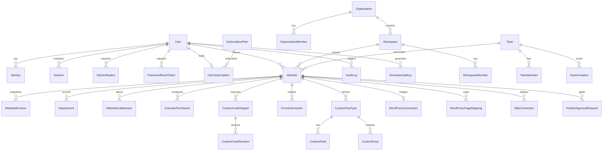

# Deliverable 06: Database and Domain Model Analysis
**Project:** ForgeStudio SaaS Platform  
**Date:** September 2026  
**Technology:** PostgreSQL 16+ via Prisma ORM 7.10  

---

## 1. Entity-Relationship Overview

The database contains 34 models spanning Identity, Tenancy, Permissions, Content, Publishing, Integrations, and Asynchronous Jobs:

---

## 2. Table-by-Table Technical Audit

### 2.1 Identity, Authentication & Sessions
1. **`User` (`users`):**
   - **Primary Key:** UUID (`id`).
   - **Fields:** `email`, `phone`, `passwordHash`, `verificationMethod`, `emailVerified`, `phoneVerified`, `status` (`ACTIVE`, `SUSPENDED`, `DELETED`), `role` (`UserRole`), `lastLoginAt`, timestamps.
   - **Indexes:** `idx_users_email`, `idx_users_phone`, `idx_users_status`, `idx_users_role`.
   - **Audit Assessment:** Solid schema; clean UUID usage; handles both email and phone-based authentication.
2. **`Session` (`sessions`):**
   - **Fields:** `tokenHash` (unique index), `expiresAt`, `revokedAt`, `lastUsedAt`.
   - **Cascade:** `onDelete: Cascade` on `User`.
   - **Audit Assessment:** Provides cryptographic session revocation and prevents zombie sessions.
3. **`OtpVerification` & `PasswordResetToken`:**
   - **Fields:** `otpHash`, `purpose`, `attempts`, `expiresAt`, `verifiedAt`.
   - **Indexes:** Indexed on `userId`, `expiresAt`, `purpose` for fast lookup and TTL cleanup.

---

### 2.2 Organizations, Workspaces & Multi-Tenancy
1. **`Organization` & `OrganizationMember`:**
   - **Isolation:** `OrganizationMember` enforces `role` (`OWNER`, `ADMIN`, `MEMBER`) and composite uniqueness `[organizationId, userId]`.
2. **`Workspace` & `WorkspaceMember`:**
   - **Isolation:** Sub-tenant boundary under Organization, with composite uniqueness `[workspaceId, userId]`.
3. **`Team`, `TeamMember`, `TeamInvitation`:**
   - **Collaboration:** Enables project teams with explicit roles (`OWNER`, `ADMIN`, `DESIGNER`, `CONTENT_EDITOR`, `REVIEWER`).
   - **Invitations:** Secured with `tokenHash` (unique), status (`PENDING`, `ACCEPTED`, `REJECTED`, `EXPIRED`), and expiration timestamp.

---

### 2.3 Website Data, Revisions & Canonical Schema
1. **`Website` (`websites`):**
   - **Fields:** `name`, `slug`, `status`, `editorData` (JSONB default `{"version": 1, "elements": []}`).
   - **Tenancy Links:** References `userId`, optional `organizationId`, `workspaceId`, and `teamId`.
   - **Indexes:** `idx_websites_user_id`, `idx_websites_organizationId`.
   - **Data Integrity:** `editorData` contains the canonical multi-page tree, site parts, global styles, and settings.
2. **`WebsiteRevision` (`website_revisions`):**
   - **Fields:** `websiteId`, `version`, `revisionType` (`MANUAL`, `PUBLISH`, `CHECKPOINT`, `RESTORE`), `description`, `data` (JSONB snapshot), `createdBy`.
   - **Constraint:** Unique constraint on `[websiteId, version]` ensures monotonic version integrity.
   - **Indexes:** `websiteId`, `[websiteId, createdAt]`.

---

### 2.4 Deployments, Publishing & Connections
1. **`Deployment` (`deployments`):**
   - **Fields:** `websiteId`, `version`, `status` (`QUEUED`, `VALIDATING`, `BUILDING`, `PROCESSING`, `DEPLOYING`, `VERIFYING`, `PUBLISHED`, `FAILED`, etc.), `environment` (`PRODUCTION`, `STAGING`, `DEVELOPMENT`), `destinationType` (`INTERNAL`, `WORDPRESS`, `SFTP`, `STATIC`), `destinationRef`, `metadata`, `error`, timestamps.
   - **Indexes:** `websiteId`, `[websiteId, createdAt]`, `status`.
2. **`WordPressConnection` (`wordpress_connections`):**
   - **Fields:** `userId`, `websiteId` (unique), `siteUrl`, `status`, `wpSiteName`, `apiKeyHash`, `capabilities`, `metadata`, `lastVerifiedAt`.
3. **`WordPressPageMapping` (`wordpress_page_mappings`):**
   - **Fields:** `websiteId`, `forgePageId`, `wpPostId`, `wpPostSlug`, `wpPostUrl`, `lastSyncedAt`.
   - **Constraint:** Unique on `[websiteId, forgePageId]`.
4. **`SftpConnection` (`sftp_connections`):**
   - **Fields:** `websiteId`, `host`, `port`, `username`, `remotePath`, `isActive`.

---

### 2.5 Access Control & Governance
1. **`GranularPermission` (`granular_permissions`):**
   - **Fields:** `websiteId`, `userId`, `resourceId` (default `*`), `capability`, `effect` (`ALLOW`, `DENY`).
   - **Constraint:** Unique on `[websiteId, userId, resourceId, capability]`.
2. **`ComponentAccess` (`component_accesses`):**
   - **Fields:** `websiteId`, `componentId`, `elementId`, `userId`, `permission` (`VIEW`, `EDIT`).
   - **Constraint:** Unique on `[websiteId, componentId]`.
3. **`AuditLog` (`audit_logs`):**
   - **Fields:** `userId`, `action`, `targetResource`, `details` (JSONB), `ipAddress`, `createdAt`.
   - **Indexes:** `userId`, `action`.

---

### 2.6 Asynchronous Processing & Background Jobs
1. **`BackgroundJob` (`background_jobs`):**
   - **Fields:** `type`, `payload` (JSONB), `status` (`QUEUED`, `RUNNING`, `COMPLETED`, `FAILED`, `CANCELLED`), `attempts`, `maxAttempts`, `lastError`, `runAt`, `startedAt`, `completedAt`.
   - **Indexes:** `[status, runAt]` (composite index for high-performance FIFO job polling), `type`.

---

## 3. Schema Gaps & Additive Recommendations

1. **Global Roles Extension:**
   - Add values `PLATFORM_ADMIN`, `SUPPORT_ADMIN`, `DEVELOPER`, `AI_CONTENT_ADMIN`, `CUSTOMER`, `TEAM_MEMBER` to Prisma `UserRole` enum without breaking legacy rows.
2. **Subscription Entitlements:**
   - Add `stripeCustomerId`, `stripeSubscriptionId`, and `cancelAtPeriodEnd` columns to `user_subscriptions` to support complete billing automation.
3. **Media Management Table:**
   - Currently, uploads are stored directly on disk (`/uploads`) without a database `MediaAsset` model tracking MIME types, file sizes, alt texts, and dimensions.
   - Recommended additive model: `MediaAsset` linked to `websiteId` and `userId`.
