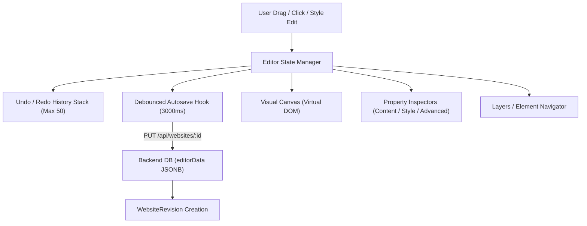

# Deliverable 09: Editor Architecture Analysis
**Project:** ForgeStudio SaaS Platform  
**Date:** September 2026  
**Subject:** Deep Technical Inspection of `WebsiteEditor.tsx` & Visual Engine  

---

## 1. State Management & Lifecycle

The visual editor (`WebsiteEditor.tsx`) is the central design studio of ForgeStudio. It coordinates canvas rendering, element selection, drag-and-drop manipulation, style calculation, undo/redo history, responsive breakpoints, and server synchronization.



---

## 2. Element Data Model & Canonical Structure

Every visible entity on the canvas is typed as an `EditorElement`:

```typescript
export interface EditorElement {
  id: string;
  type: ElementType;
  content?: string;
  text?: string;
  styles?: Record<string, any>;
  responsiveStyles?: {
    desktop?: Record<string, any>;
    tablet?: Record<string, any>;
    mobile?: Record<string, any>;
  };
  customCss?: string;
  customAttributes?: Record<string, string>;
  displayConditions?: DisplayConditionGroup[];
  motionEffects?: MotionEffectsConfig;
  elements?: EditorElement[]; // Nestable container children
  columns?: ColumnConfig[];
  fields?: FormFieldItem[];
  // Widget-specific payloads (slides, price plans, nav items)
  [key: string]: any;
}
```

Multi-page sites group elements under `pages: PageConfig[]` with an explicit `homePageId` and global parts (`siteParts.header`, `siteParts.footer`).

---

## 3. Core Engine Mechanics

### 3.1 Drag-and-Drop (DnD) Engine
- Uses native HTML5 Drag and Drop events (`onDragStart`, `onDragOver`, `onDrop`, `onDragEnd`).
- Palette items serialize `{ type: "new", widgetType: "..." }` into `dataTransfer.setData("application/json", ...)`.
- Existing canvas elements serialize `{ type: "move", elementId: "...", sourceContainerId: "..." }`.
- Drop zones compute insertion index based on cursor proximity, preventing illegal container nesting loops (e.g. dropping a parent into its own descendant).

### 3.2 Responsive Override Cascade
- ForgeStudio follows a **Desktop-First Cascade**:
  ```
  Base / Desktop Styles (100% Canvas Width)
             │ (inherited if unset)
             ▼
  Tablet Overrides (768px Viewport)
             │ (inherited if unset)
             ▼
  Mobile Overrides (375px Viewport)
  ```
- The helper `resolveElementStyles(element, currentBreakpoint)` dynamically merges the base `styles` with the breakpoint-specific overrides, allowing seamless live previewing across devices.

### 3.3 Undo / Redo History Stack
- Maintained as an array of serialized snapshot strings (`history: string[]`, `historyIndex: number`).
- Every non-continuous action (element add, delete, duplicate, drag drop, style commit) pushes a new state to the stack.
- Maximum stack depth is bounded (default 50 snapshots) to prevent browser memory leaks.

---

## 4. Identified Architectural Risks & Bottlenecks

1. **File Size / Monolithic Component (`WebsiteEditor.tsx`):**
   - At **17,367 lines (895 KB)**, `WebsiteEditor.tsx` is an extremely large React component.
   - It contains internal state hooks, drag handlers, toolbar JSX, sidebar tabs, inspector controls, and multiple inline modal dialogs.
   - **Risk:** High cognitive load, merge conflict vulnerability when multiple developers work on editor features, and long compilation times.
2. **Re-render Optimization:**
   - Typing in an inspector field triggers full-tree style recalculation.
   - While modern React 19 handles virtual DOM diffing efficiently, large pages with >200 elements experience slight input latency.
3. **Safe Additive Modularization Plan (Non-Negotiable Rule #2):**
   - **DO NOT rewrite the editor.** The existing editor works and has extensive capabilities.
   - Instead, follow an additive refactoring strategy:
     - Keep `WebsiteEditor.tsx` as the master coordinator.
     - Sub-inspectors and modal bodies that are already partially extracted into `DynamicWidgetInspectors.tsx` and `components/` should continue to be enriched independently.
