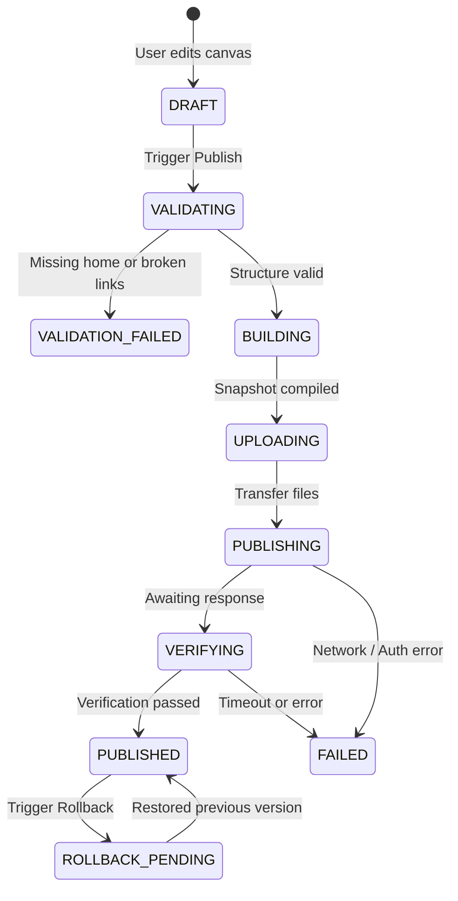

# Deliverable 11: Deployment and Publishing Audit
**Project:** ForgeStudio SaaS Platform  
**Date:** September 2026  
**Subject:** End-to-End Audit of Multi-Destination Publishing & Rollback Pipelines  

---

## 1. Publishing Pipeline Architecture

ForgeStudio decouples visual editing from public distribution through a multi-stage publishing pipeline governed by `publishing.service.ts` and the `DestinationPublisher` registry interface.

---

## 2. Destination Adapters Audit

| Destination | Technology | Implementation Details | Production Readiness |
| :--- | :--- | :--- | :--- |
| **INTERNAL** | PostgreSQL JSONB | Stored in `websites.editorData` with `status: 'PUBLISHED'`. Served directly via `/api/websites/public/:id` to `PublishedSite.tsx`. | **100% PRODUCTION READY.** Immutable versioning and fast query times. |
| **STATIC EXPORT** | Node.js `archiver` + `staticCompiler.ts` | Compiles `CanonicalWebsiteData` into static HTML files, global CSS (`styles.css`), and ZIP archive. | **PARTIALLY READY.** Core widgets render well; needs expanded coverage for all 40+ Pro/Interactive widgets. |
| **SFTP TRANSPORT**| `ssh2-sftp-client` | Connects over SSH2, creates remote directory paths recursively, uploads static assets via buffer streams, verifies byte counts. | **100% PRODUCTION READY.** Real file transfer, real directory reconciliation, error handling. |
| **WORDPRESS** | REST API Bridge | Maps canonical pages to WordPress pages using Gutenberg blocks and Yoast SEO metadata. | **DEFECTIVE:** Currently simulates post IDs (`wpPostId = 1000 + ...`); lacks real connector plugin and real HTTP dispatch. |

---

## 3. Pre-Publish Validation Checks

The validator `validateWebsiteForPublish()` in `publishing.service.ts` enforces:
1. **Authorization Guard:** User has `PUBLISH` capability on target website.
2. **Data Integrity:** `editorData` must contain valid JSON with non-empty pages.
3. **Home Page Designation:** Exactly one active page must be designated as the home page (`isHome: true` or `id === homePageId`).
4. **Slug Uniqueness:** No two pages may share identical URL slugs.
5. **Approval Workflow:** If `approvalWorkflowEnabled: true` on the website, publishing is blocked unless a `PublishApprovalRequest` has `status: 'APPROVED'`.

---

## 4. Reconciling WordPress Publishing (Eliminating Simulation)

To comply with Non-Negotiable Development Rule #6:
1. **WordPress Connector Plugin:** Build `/wordpress-plugin/forgestudio-connector.php` providing authenticated endpoints:
   - `POST /wp-json/forgestudio/v1/auth/connect`
   - `GET /wp-json/forgestudio/v1/auth/verify`
   - `POST /wp-json/forgestudio/v1/publish`
   - `POST /wp-json/forgestudio/v1/publish/:id/rollback`
2. **Real HTTP Dispatcher in Backend:** Replace simulated post ID assignment with real authenticated `fetch()` calls transmitting Gutenberg blocks and metadata.
3. **Verification Step:** Query the live published URL and WordPress REST API to verify HTTP 200 before transitioning deployment status to `PUBLISHED`.
