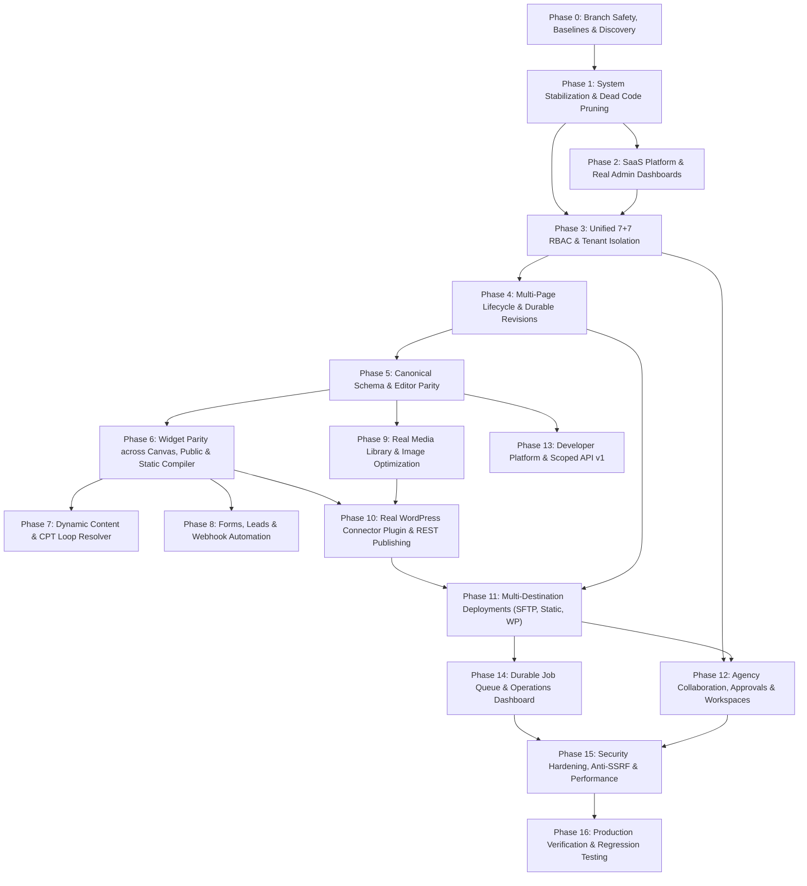

# Deliverable 16: Feature Dependency Graph
**Project:** ForgeStudio SaaS Platform  
**Date:** September 2026  
**Scope:** Architectural Dependency Hierarchy Across All Implementation Phases  

---

## 1. High-Level Workstream Dependency Model

---

## 2. Critical Dependency Invariants

1. **Schema Precedes Editor:** The `CanonicalWebsiteData` TypeScript definitions and PostgreSQL JSONB validators must be finalized before adding new widget attributes to the editor canvas.
2. **Real WordPress Plugin Precedes WordPress Publishing:** In accordance with Rule #6, we cannot test or claim WordPress publishing works without the real `forgestudio-connector` PHP plugin deployed and responding to REST calls.
3. **Widget Renderer Parity:** Any widget that renders in `renderers.tsx` for the visual canvas MUST have equivalent render branches in `PublishedSite.tsx` and `staticCompiler.ts`.
4. **Server-Side RBAC Precedes Collaboration UI:** Role inheritance and capability overrides must be strictly validated on the backend before building agency team management frontends.
