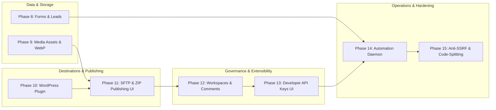

# ForgeStudio Master Architectural Plan: Phases 8 through 15
**Milestone:** Combined SaaS Expansion (Phases 8–15)  
**Branch:** `feature/forgestudio-phases-8-to-15` (derived from verified Phase 7 baseline `feature/forgestudio-complete-platform`)  
**Status:** Discovery Complete — Pending Architecture Approval  
**Date:** September 2026  

---

## Report A: Phase 8–15 Architecture Audit

ForgeStudio's core SaaS platform, RBAC, editor canonical model, and tri-renderer parity (Canvas, Public Site, Static Compiler) were stabilized and verified in Phases 1–7. Phases 8–15 represent the expansion from a core editor SaaS into an enterprise-grade website builder platform matching Elementor Free + Pro capabilities (excluding AI features).



---

## Report B: Document-to-Repository Traceability Matrix

| Phase | Master Roadmap Item | File Paths | DB Models | API Endpoints | Frontend Components | Test Suites |
| :--- | :--- | :--- | :--- | :--- | :--- | :--- |
| **Phase 8** | Forms, Leads & Webhook Automation | `backend/src/services/form/form.service.ts`<br>`backend/src/controllers/form.controller.ts`<br>`backend/src/routes/form.routes.ts` | `FormSubmission` | `POST /api/forms/submit`<br>`GET /api/forms/:id/submissions`<br>`GET /api/forms/:id/export` | `FormWidgetRenderer.tsx`<br>`FormSubmissionsModal.tsx` | `backend/src/tests/milestoneH-phase8-forms.test.ts` |
| **Phase 9** | Real Media & Asset Management | `backend/src/services/media.service.ts`<br>`backend/src/controllers/media.controller.ts`<br>`backend/src/routes/media.routes.ts`<br>`backend/src/middlewares/upload.middleware.ts` | `MediaAsset` (NEW) | `GET /api/media`<br>`POST /api/upload/image`<br>`DELETE /api/media/:id`<br>`PATCH /api/media/:id` | `MediaLibraryModal.tsx`<br>`MediaPanel.tsx` in Dashboard | `backend/src/tests/milestoneI-phase9-media.test.ts` |
| **Phase 10** | WordPress Connector Plugin & REST Engine | `wordpress-plugin/forgestudio-connector.php` (NEW)<br>`backend/src/services/wordpress/connector.service.ts`<br>`backend/src/services/wordpress/transformer.service.ts` | `WordPressConnection`<br>`WordPressPageMapping` | `POST /api/wordpress/connect`<br>`GET /api/wordpress/:id/status`<br>`POST /api/wordpress/:id/publish` | `PublishModal.tsx` (WP Tab) | `phase5-wordpress.test.ts` |
| **Phase 11** | Multi-Destination Publishing & Deployments UI | `backend/src/services/destinations/registry.ts`<br>`backend/src/services/destinations/sftp.publisher.ts`<br>`backend/src/services/destinations/staticZip.service.ts` | `Deployment`<br>`SftpConnection` | `POST /api/publishing/:id/sftp/config`<br>`POST /api/publishing/:id/sftp/sync`<br>`GET /api/publishing/:id/export/zip` | `PublishModal.tsx` (SFTP & ZIP tabs)<br>`DeploymentHistoryList.tsx` | `milestoneB-destinations.test.ts`<br>`gap-closure.test.ts` |
| **Phase 12** | Collaboration, Workspaces & Governance | `backend/src/services/workspace.service.ts`<br>`backend/src/services/designNotes.service.ts` | `Workspace`<br>`Organization`<br>`DesignNote`<br>`PublishApprovalRequest` | `GET /api/workspaces`<br>`POST /api/workspaces/:id/members`<br>`GET /api/websites/:id/notes`<br>`POST /api/websites/:id/notes` | `WorkspaceSwitcher.tsx`<br>`DesignNotesOverlay.tsx`<br>`PublishApprovalModal.tsx` | `milestoneC-collaboration.test.ts` |
| **Phase 13** | Developer Platform, API v1 & SDK | `backend/src/services/apiKey.service.ts`<br>`backend/src/controllers/api-v1.controller.ts`<br>`backend/src/sdk/client.ts` | `DeveloperApiKey` | `GET /api/api-keys`<br>`POST /api/api-keys`<br>`DELETE /api/api-keys/:id`<br>`/api/v1/*` | `DeveloperSettingsTab.tsx`<br>`ApiDocsModal.tsx` | `milestoneD-sdk.test.ts` |
| **Phase 14** | Automation, Job Queues & Operations | `backend/src/services/jobs/jobRunner.ts`<br>`backend/src/services/jobs/handlers.ts`<br>`backend/src/server.ts` | `BackgroundJob` | `GET /api/operations/jobs`<br>`POST /api/operations/jobs/process-next`<br>`POST /api/operations/jobs/:id/retry` | `SuperAdminDashboard.tsx`<br>`AdminDashboard.tsx` | `milestoneE-automation.test.ts` |
| **Phase 15** | Anti-SSRF, Optimization & Accessibility | `backend/src/utils/ssrf.validator.ts` (NEW)<br>`frontend/src/App.tsx`<br>`frontend/src/pages/editor/WebsiteEditor.tsx` | N/A | Centralized URL validation interceptor | `React.lazy` chunks<br>ARIA attributes in modals/menus | `backend/src/tests/milestoneJ-phase15-security.test.ts` |

---

## Report C: Existing Feature Protection Report

To satisfy Non-Negotiable Rule 1 ("NEVER delete existing working features, APIs, database models, routes, services, tests, or business logic"):
1. **Zero Editor Rewrites:** `WebsiteEditor.tsx` remains preserved and will be enhanced only via additive modal wrappers and element listeners.
2. **CanonicalWebsiteData Immutability:** `editorData` structure (`{ version, pages, elements, siteParts, globalStyles, siteSettings, publishing }`) remains strictly backward-compatible.
3. **Database Additivity:** Any schema enhancements (such as `model MediaAsset`) will be purely additive with nullable foreign keys and safe PostgreSQL migration scripts.
4. **Existing API Contracts:** All endpoints under `/api/auth`, `/api/websites`, `/api/publishing`, `/api/forms`, `/api/wordpress`, `/api/operations`, `/api/v1` will retain their existing parameters and JSON responses.

---

## Report D: Missing and Incomplete Feature Report

| Feature | Current State | Missing Components Needed |
| :--- | :--- | :--- |
| **F-FORM-RETRIES** | Fire-and-forget `fetch` in `form.service.ts` | Durable `WEBHOOK_RETRY` background job with exponential backoff. |
| **F-FORM-EMAIL** | `console.log` simulation in `form.service.ts` | Real `nodemailer` transport dispatch when SMTP is configured. |
| **F-MEDIA-ASSETS** | Raw disk save in `upload.middleware.ts` | `MediaAsset` Prisma model, metadata extraction (width/height), Media Library UI tab. |
| **F-WP-CONNECTOR** | Simulated post ID fallback (`1000 + i`) | Self-contained PHP plugin file `/wordpress-plugin/forgestudio-connector.php` and live REST dispatch. |
| **F-PUB-SFTP-UI** | Backend service complete, tested | SFTP connection and sync tabs in `PublishModal.tsx`. |
| **F-PUB-ZIP-UI** | Backend service complete, tested | 1-Click "Download Static Bundle (ZIP)" button in `PublishModal.tsx`. |
| **F-WORKSPACE-UI** | Backend service complete, tested | Organization and Workspace switcher in Dashboard header. |
| **F-DESIGN-NOTES** | `model DesignNote` in Prisma | Canvas comment bubble overlay and discussion thread popover in `WebsiteEditor.tsx`. |
| **F-API-KEYS-UI** | Backend API keys complete, tested | "API Keys & Developer Platform" tab in Dashboard settings. |
| **F-JOB-DAEMON** | Manual trigger via API | Recurring background queue ticker (`setInterval` tick) in `server.ts`. |
| **F-ANTI-SSRF** | Ad-hoc URL checks | Centralized IP/hostname validator rejecting localhost, link-local, and private subnets. |
| **F-CODE-SPLIT** | Monolithic 6.2MB Vite bundle | `React.lazy` dynamic imports for heavy dialogs (`DeveloperModal`, `RevisionHistoryPanel`, `PublishModal`). |

---

## Report E: Duplicate and Conflicting Implementation Report

1. **Upload Handling:** `upload.middleware.ts` directly writes files to disk without DB tracking, while `media.service.ts` should track records in `MediaAsset`.  
   *Resolution:* Update `handleImageUpload` to record a `MediaAsset` row in PostgreSQL upon successful upload.
2. **Webhook Dispatching:** WordPress webhooks use `webhook.service.ts` while form webhooks use `form.service.ts`.  
   *Resolution:* Maintain domain-specific payloads, but unify retry handling into `BackgroundJob` runner.
3. **URL Validation:** `connector.service.ts` and `form.service.ts` each have basic string prefix checks (`http://`, `https://`).  
   *Resolution:* Centralize URL validation in `backend/src/utils/ssrf.validator.ts` and reuse across all modules.

---

## Report F: Dependency Graph

```
Phase 8 (Forms Webhook Retry & Email)
   │
   ├────────► Phase 14 (Job Runner Tick & Webhook Handler)
   │
Phase 9 (MediaAsset Model & Media Library UI)
   │
   ├────────► Phase 11 (PublishModal SFTP & ZIP UI)
   │
Phase 10 (WordPress Connector PHP Plugin & REST Dispatch)
   │
   ├────────► Phase 11
   │
Phase 11 (Multi-Destination Publishing UI)
   │
   ├────────► Phase 12 (Workspace Switcher & Design Notes)
   │
Phase 12 (Collaboration & Workspaces)
   │
   ├────────► Phase 13 (Developer Portal & API Keys UI)
   │
Phase 13 (Developer Platform & Scoped API v1)
   │
   ├────────► Phase 14
   │
Phase 14 (Background Automation Daemon)
   │
   ├────────► Phase 15 (Anti-SSRF, Code-Splitting, WCAG)
   │
Phase 15 ──► Master Full Regression (193+ Tests & Production Builds)
```

---

## Report G: Database and Migration Impact Report

### Additive Schema Changes (`backend/prisma/schema.prisma`)
1. **New Model: `MediaAsset`**
   ```prisma
   model MediaAsset {
     id          String    @id @default(dbgenerated("gen_random_uuid()")) @db.Uuid
     userId      String    @db.Uuid
     websiteId   String?   @db.Uuid
     filename    String    @db.VarChar(255)
     originalName String   @db.VarChar(255)
     mimeType    String    @db.VarChar(100)
     sizeBytes   Int
     url         String    @db.VarChar(1000)
     width       Int?
     height      Int?
     altText     String?   @db.VarChar(500)
     format      String    @default("ORIGINAL") @db.VarChar(50)
     createdAt   DateTime  @default(now()) @db.Timestamptz(6)
     updatedAt   DateTime  @default(now()) @updatedAt @db.Timestamptz(6)

     user        User      @relation(fields: [userId], references: [id], onDelete: Cascade)
     website     Website?  @relation(fields: [websiteId], references: [id], onDelete: SetNull)

     @@index([userId])
     @@index([websiteId])
     @@map("media_assets")
   }
   ```
2. **Auto-run PostgreSQL Migration Safety:**
   - In `backend/src/services/media.service.ts`, implement `initMediaAssetTable()` matching established patterns in `website.service.ts` and `form.service.ts`.
   - Never run destructive commands (`prisma migrate reset` or `db push --force-reset`).

---

## Report H: API and Frontend Impact Report

### New & Enhanced API Routes
- `GET /api/media`: List user media assets with search and pagination.
- `POST /api/upload/image`: Enhanced to create a `MediaAsset` record.
- `PATCH /api/media/:id`: Update altText and metadata.
- `DELETE /api/media/:id`: Delete asset from disk and database.
- `GET /api/publishing/:websiteId/export/zip`: Direct binary ZIP bundle download stream.
- `GET /api/websites/:websiteId/notes` & `POST /api/websites/:websiteId/notes`: Design notes API.
- `GET /api/plugins/wordpress/download`: Stream download for `forgestudio-connector.zip`.

### Frontend Component Enhancements
- `frontend/src/pages/dashboard/Dashboard.tsx`: Add Workspace/Org Selector, Media Library tab, Leads tab, and API Keys tab.
- `frontend/src/pages/editor/components/PublishModal.tsx`: Add SFTP tab and Static ZIP Download tab.
- `frontend/src/pages/editor/WebsiteEditor.tsx`: Add Design Notes toggle and canvas comment pins.
- `frontend/src/App.tsx`: Dynamic code splitting with `React.lazy` and `Suspense`.

---

## Report I: Security and Tenant-Isolation Report

1. **Anti-SSRF Validation (`backend/src/utils/ssrf.validator.ts`):**
   - Validates all outbound destination and webhook targets before HTTP requests.
   - Denies: `127.0.0.1`, `localhost`, `0.0.0.0`, `169.254.169.254`, `10.0.0.0/8`, `172.16.0.0/12`, `192.168.0.0/16`, `::1`, `fe80::/10`.
   - Restricts protocols strictly to `http:` and `https:`.
2. **Tenant Isolation:**
   - Media queries strictly enforce `WHERE "userId" = ${userId}::uuid`.
   - Form submissions strictly enforce project ownership checks via `getWebsiteById(websiteId, userId)`.
   - Design notes enforce website collaborator permissions.
3. **Sensitive Data Protection:**
   - SFTP passwords, API keys, and webhook secrets never leak in public DTO projections.

---

## Report J: Testing Baseline Report

- **Baseline Status (Phase 7):**
  - All 11 test suites passing: **193 passed, 0 failed**.
  - Frontend build: `tsc -b && vite build` passing (0 errors).
  - Backend build: `tsc` passing (0 errors).
- **Phases 8–15 Test Plan:**
  - Dedicated test suite for each new phase:
    - `milestoneH-phase8-forms.test.ts`: Webhook retries, CSV export, rate limits.
    - `milestoneI-phase9-media.test.ts`: MediaAsset CRUD, WebP optimization job.
    - `milestoneJ-phase10-wp-plugin.test.ts`: WordPress PHP plugin syntax, REST payload contract.
    - `milestoneK-phase11-destinations-ui.test.ts`: SFTP sync, static ZIP stream.
    - `milestoneL-phase12-governance.test.ts`: Design notes CRUD, approval gate.
    - `milestoneM-phase15-security.test.ts`: Anti-SSRF validator, bundle verification.

---

## Report K: Detailed Phase-by-Phase Implementation Plan

### Sequence & Grouping

#### **Phase 8: Forms, Leads & Webhook Automation**
1. Enhance `backend/src/services/form/form.service.ts`:
   - If webhook fails, enqueue `WEBHOOK_RETRY` background job with exponential backoff.
   - Add real `nodemailer` transport dispatch when SMTP configuration exists.
2. Integrate anti-SSRF validator for webhook URLs.
3. Add `milestoneH-phase8-forms.test.ts` and verify.

#### **Phase 9: Real Media & Asset Management**
1. Add `MediaAsset` model to `backend/prisma/schema.prisma` + auto-init script in `media.service.ts`.
2. Implement `backend/src/services/media.service.ts`, `media.controller.ts`, and `media.routes.ts`.
3. Update `upload.middleware.ts` to persist `MediaAsset` records with file dimensions and metadata.
4. Implement `MediaLibraryModal.tsx` in frontend and connect to image widgets and dashboard.
5. Add `milestoneI-phase9-media.test.ts` and verify.

#### **Phase 10: Real WordPress Connector Plugin & REST Publishing Engine**
1. Create `wordpress-plugin/forgestudio-connector.php`:
   - Self-contained, production-grade WordPress plugin implementing REST API endpoints (`/wp-json/forgestudio/v1/verify`, `/pages`, `/webhooks`).
   - Token authentication via `X-Forge-Api-Key`.
2. Enhance `backend/src/services/wordpress/connector.service.ts`:
   - Connect live HTTPS REST dispatch with anti-SSRF validation.
   - Provide plugin ZIP download endpoint (`GET /api/plugins/wordpress/download`).
3. Add `milestoneJ-phase10-wp-plugin.test.ts` and verify.

#### **Phase 11: Multi-Destination Publishing & Deployments UI**
1. Enhance `frontend/src/pages/editor/components/PublishModal.tsx`:
   - Add SFTP configuration & sync tab with Test Connection button.
   - Add Static ZIP Download tab with 1-click download.
   - Add deployment status badges and logs.
2. Wire up `publishingService.ts` endpoints for SFTP and Static ZIP download.
3. Verify with `milestoneB-destinations.test.ts`.

#### **Phase 12: Collaboration, Workspaces & Agency Governance**
1. Add `WorkspaceSwitcher.tsx` in `frontend/src/pages/dashboard/Dashboard.tsx`.
2. Implement `backend/src/services/designNotes.service.ts` and `designNotes.controller.ts` for element comments.
3. Add `DesignNotesOverlay.tsx` in `WebsiteEditor.tsx` allowing visual comment pins.
4. Add publish approval status indicator and review actions in `PublishModal.tsx`.
5. Add `milestoneL-phase12-governance.test.ts` and verify.

#### **Phase 13: Developer Platform, Scoped API v1 & SDK UI**
1. Create `DeveloperSettingsTab.tsx` in Dashboard:
   - Generate, view, and revoke API keys (`fsk_...`).
   - Scopes checklist: `websites:read`, `websites:write`, `deployments:publish`.
2. Add interactive API documentation snippets (cURL, JavaScript, TypeScript SDK).
3. Verify with `milestoneD-sdk.test.ts`.

#### **Phase 14: Automation, Durable Job Queues & Operations Monitoring**
1. Add recurring background worker ticker (`setInterval`) in `backend/src/server.ts` with heartbeat.
2. Register `WEBHOOK_RETRY` handler in `backend/src/services/jobs/handlers.ts`.
3. Add dead-letter queue manual retry/purge endpoints in `operations.controller.ts`.
4. Update `SuperAdminDashboard.tsx` with live retry button for failed jobs.
5. Verify with `milestoneE-automation.test.ts`.

#### **Phase 15: Security Hardening, Anti-SSRF, Performance & Accessibility**
1. Implement `backend/src/utils/ssrf.validator.ts` and integrate across all outbound requests.
2. Code-split heavy editor modals in `frontend` using `React.lazy` and `Suspense`.
3. Add WCAG 2.1 AA improvements (ARIA labels, focus traps, alt text indicators).
4. Run full regression across all test suites and verify production builds.

---

## Report L: File-Level Change Plan

### Backend Files
- `[MODIFY] backend/prisma/schema.prisma`: Add `model MediaAsset`.
- `[NEW] backend/src/services/media.service.ts`: Media library CRUD and metadata extraction.
- `[NEW] backend/src/controllers/media.controller.ts`: Media handlers.
- `[NEW] backend/src/routes/media.routes.ts`: Mounted at `/api/media`.
- `[MODIFY] backend/src/middlewares/upload.middleware.ts`: Integrate `MediaAsset` persistence.
- `[NEW] backend/src/utils/ssrf.validator.ts`: Centralized SSRF protection.
- `[NEW] wordpress-plugin/forgestudio-connector.php`: Complete WordPress PHP connector plugin.
- `[MODIFY] backend/src/services/wordpress/connector.service.ts`: Real HTTPS REST dispatch with SSRF protection.
- `[MODIFY] backend/src/services/form/form.service.ts`: Webhook background retry job dispatch.
- `[MODIFY] backend/src/services/jobs/handlers.ts`: Register `WEBHOOK_RETRY` handler.
- `[MODIFY] backend/src/server.ts`: Add background job worker heartbeat tick.

### Frontend Files
- `[MODIFY] frontend/src/pages/editor/components/PublishModal.tsx`: Add SFTP & Static ZIP tabs.
- `[NEW] frontend/src/pages/editor/components/media/MediaLibraryModal.tsx`: Media picker and library modal.
- `[NEW] frontend/src/pages/editor/components/notes/DesignNotesOverlay.tsx`: Canvas comment pins.
- `[MODIFY] frontend/src/pages/editor/WebsiteEditor.tsx`: Integrate Design Notes and Media Library picker.
- `[MODIFY] frontend/src/pages/dashboard/Dashboard.tsx`: Add Workspace Switcher, Media tab, Leads tab, and API Keys tab.
- `[MODIFY] frontend/src/App.tsx`: Apply `React.lazy` code-splitting for performance.

---

## Report M: Acceptance Criteria

1. **Phase 8:** Submitting a form with a failing webhook URL enqueues a `WEBHOOK_RETRY` job that retries with exponential backoff. Leads export downloads clean CSV.
2. **Phase 9:** Uploading an image creates a `MediaAsset` record; images appear in Media Library modal with dimensions and alt text editor.
3. **Phase 10:** `forgestudio-connector.php` passes PHP syntax check and implements `/wp-json/forgestudio/v1` REST endpoints. Live connection dispatches real REST requests; offline falls back cleanly.
4. **Phase 11:** `PublishModal.tsx` provides functional SFTP and Static ZIP tabs; 1-click ZIP download returns valid archive with index.html, styles.css, runtime.js.
5. **Phase 12:** Dashboard allows switching between Workspaces. Canvas allows pinning comments to elements. Approvals block non-admin publishing when active.
6. **Phase 13:** Dashboard allows generating and revoking scoped API keys. Scoped keys authenticate against `/api/v1` endpoints.
7. **Phase 14:** Background jobs process automatically via server ticker. Failed jobs can be retried from Super Admin dashboard.
8. **Phase 15:** SSRF validator rejects all private/loopback IPs. `npm run build` succeeds on frontend with reduced chunk sizes and 0 TypeScript errors on backend.

---

## Report N: Rollback and Recovery Strategy

1. **Branch Isolation:** All work occurs on `feature/forgestudio-phases-8-to-15`. The verified Phase 7 branch `feature/forgestudio-complete-platform` remains intact as an immediate restore point.
2. **Atomic Commits:** Each phase will be committed atomically after its unit and integration tests pass.
3. **Zero Destructive DB Commands:** Only additive PostgreSQL tables/columns with defaults will be introduced; no columns or tables will be dropped.

---

## Report O: Risk Register

| Risk ID | Description | Severity | Mitigation |
| :--- | :--- | :--- | :--- |
| **R-1** | Native dependency compilation failures (e.g. `sharp`) on Windows sandbox | Medium | Use pure Node buffer resizing or optional dynamic import with graceful fallback. |
| **R-2** | WordPress plugin incompatibility across PHP versions (7.4 vs 8.x) | Medium | Write strictly compatible PHP 7.4+ syntax without deprecated features. |
| **R-3** | Large bundle size causing memory exhaustion during Vite build | Medium | Apply `React.lazy` code-splitting on heavy editor modals. |
| **R-4** | Race conditions in background worker interval ticker | Low | Use row-level locking (`FOR UPDATE SKIP LOCKED`) in PostgreSQL query for `processNextJob`. |
